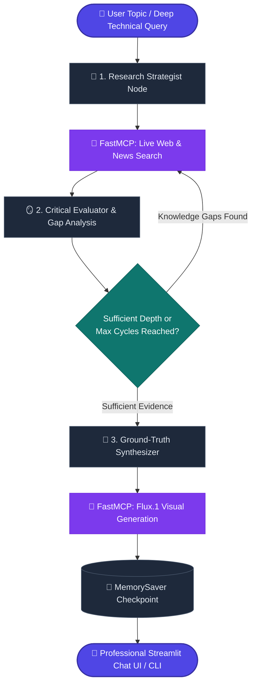

<div align="center">

# 🔬 Autonomous Research AI Agent

**An unconstrained, deep-thinking autonomous research agent powered by LangGraph, Groq LPU inference, FastMCP tool execution, real-time web intelligence, and zero-cost Flux.1 concept visuals.**

[](https://ai-research-agent-cpap9aq7vfxuvnbzkfkhck.streamlit.app/)
[](https://www.python.org/)
[](https://langchain-ai.github.io/langgraph/)
[-8A2BE2.svg?style=flat)](https://github.com/jlowin/fastmcp)
[](https://groq.com/)
[](https://opensource.org/licenses/MIT)

[**🌐 Explore Live Demo**](https://ai-research-agent-cpap9aq7vfxuvnbzkfkhck.streamlit.app/) • [**✨ Key Features**](#-key-features) • [**🧠 Architecture**](#-agentic-architecture) • [**⚡ Quick Start**](#-quick-start) • [**🚀 Deployment**](#-one-click-cloud-deployment)

---

</div>

## 🌟 Highlights

Traditional chatbots answer queries using static, outdated training weights. This **Autonomous Research AI Agent** is an unconstrained agentic workflow that formulates investigative hypotheses, navigates live real-world web data across news and technical sources, critically reflects on knowledge gaps, iteratively deepens its research, and synthesizes publication-ready reports with verified source citations and accompanying visual concept art.

```
       User Inquiry ➔ Autonomous Strategy ➔ Dual-Engine Live Search
                              │                      │
                              ▼                      ▼
                     Flux Visual Concept ⬅ Final Synthesis ⬅ Dynamic Reflection Loop
```

---

## ✨ Key Features

### 1. 🧠 Autonomous LangGraph Reflection Loop
- **Multi-Cycle Deepening**: Automatically formulates 2–3 targeted search queries, critiques gathered evidence against the core question, identifies knowledge gaps, and executes follow-up searches until comprehensive depth is reached.
- **Parametric Override**: Ground-truth anchored synthesizer that prioritizes live 2026 search evidence over historical model training cutoffs.

### 2. 🔌 Model Context Protocol (MCP) Standardized Tools
- **FastMCP Tool Architecture** (`mcp_server.py`): Fully decoupled server providing `search_web`, `generate_image`, and `fetch_page` tools.
- **Universal Compatibility**: Compatible with LangGraph, Claude Desktop, Cursor, and any MCP-compliant ecosystem.

### 3. 🎨 100% Free AI Concept Visuals (Flux.1 Engine)
- **Zero-Cost Visual Generation**: Produces crisp, high-resolution conceptual infographics and diagrams for each research subject powered by Pollinations Flux.1.
- **No API Keys or Credits Required**: Completely free and unlimited for all users.

### 4. 💬 Modern Professional Chatbot UI (`app.py`)
- **Perplexity-Style Source Chips**: Numbered interactive badge pills linking directly to live, verified web citations.
- **Framed Visual Cards**: High-res concept cards with built-in preview and download capabilities.
- **Collapsible Research Log**: Step-by-step thinking traces displaying queries, reflections, and tool responses.
- **Multi-Thread Persistence**: Seamlessly switch, rename, or delete parallel research conversations with `MemorySaver` state checkpointers.

### 5. ⚡ Ultra-Fast Multi-Provider LLM Engine
- **Default Super-Engine**: **Groq LPU** (`openai/gpt-oss-120b` or `llama-3.3-70b-versatile`) for 500+ tokens/second inference.
- **Multi-Model Support**: Native support for **Google Gemini** (`gemini-2.5-flash`), **OpenAI** (`gpt-4o`), and offline **Ollama** (`llama3.1`).

---

## 🧠 Agentic Architecture



---

## 📊 Comparison Matrix

| Feature | Standard LLM Chat | Simple Web RAG | 🔬 This Research Agent |
| :--- | :---: | :---: | :---: |
| **Real-time Live News & Web Data** | ❌ (Static Cutoff) | ⚠️ (Single Search) | ✅ **Multi-Cycle Deep Search** |
| **Knowledge Gap Reflection** | ❌ None | ❌ None | ✅ **Autonomous Loop (`plan ➔ reflect`)** |
| **Tool Protocol** | Proprietary | Ad-hoc | ✅ **Model Context Protocol (MCP)** |
| **Visual Generation** | ❌ None / Paid | ❌ None | ✅ **100% Free Flux.1 Concept Cards** |
| **Verified Citations** | ❌ Hallucinations | ⚠️ Basic Links | ✅ **Perplexity-Style Source Badges** |
| **Multi-Thread Chat Memory** | ⚠️ Basic | ⚠️ Basic | ✅ **LangGraph `MemorySaver` Persistence** |

---

## ⚡ Quick Start

### 1. Clone the Repository
```bash
git clone https://github.com/Sanil656/AI-Research-Agent.git
cd AI-Research-Agent
```

### 2. Create and Activate a Virtual Environment
```bash
python -m venv venv
# Windows:
.\venv\Scripts\activate
# macOS/Linux:
source venv/bin/activate
```

### 3. Install Dependencies
```bash
pip install -r requirements.txt
```

### 4. Configure Environment
Create a `.env` file in the root directory (or copy `.env.example`):
```env
# Free Groq API Key (get from https://console.groq.com)
GROQ_API_KEY=gsk_your_groq_api_key_here
DEFAULT_LLM_PROVIDER=groq
GROQ_MODEL=openai/gpt-oss-120b

# Optional: Gemini, OpenAI, or Tavily
# GEMINI_API_KEY=your_gemini_key
# OPENAI_API_KEY=your_openai_key
```

### 5. Launch the Application

#### 🌐 Interactive Streamlit Chatbot
```bash
streamlit run app.py
```

#### 💻 Terminal CLI Mode
```bash
python main.py
```

#### 🔌 Standalone FastMCP Tool Server
```bash
python mcp_server.py
```

---

## 🚀 One-Click Cloud Deployment

You can deploy your own instance to **Streamlit Community Cloud** for free:

1. Fork or push this repository to your GitHub account.
2. Go to [**share.streamlit.io**](https://share.streamlit.io/) and click **Create App**.
3. Select your repository: `AI-Research-Agent`, Branch: `main`, Main file: `app.py`.
4. In **Settings ➔ Secrets**, paste:
   ```toml
   GROQ_API_KEY = "gsk_your_groq_key_here"
   DEFAULT_LLM_PROVIDER = "groq"
   GROQ_MODEL = "openai/gpt-oss-120b"
   ```
5. Click **Deploy**! Your app will be live with a public URL in seconds.

---

## 📁 Repository Structure

```text
├── app.py              # Modern Streamlit chatbot UI with Perplexity-style cards & threads
├── agent.py            # LangGraph StateGraph engine with reflection loop & memory
├── state.py            # ResearchState TypedDict schema with multi-turn chat history
├── mcp_server.py       # Standalone FastMCP Tool Server (search, image, scrape)
├── mcp_tools.py        # LangGraph client connector for FastMCP tools
├── tools.py            # DuckDuckGo Dual Search (News + Text) & Pollinations Flux generator
├── config.py           # Multi-provider LLM factory (Groq, Gemini, OpenAI, Ollama)
├── main.py             # Rich interactive Terminal CLI client
├── requirements.txt    # Production dependencies
├── .env.example        # Environment variable template
└── README.md           # Project documentation
```

---

## 🛡️ Privacy & Security

- **Zero-Storage Keys**: API keys entered in the UI are kept strictly in session memory and never logged or persisted.
- **Git-Protected**: Local `.env` credentials and cache directories are permanently protected via `.gitignore`.

---

## 📄 License

This project is licensed under the **MIT License**.

<div align="center">

**Built with ❤️ using LangGraph, FastMCP, Streamlit, and Groq.**

</div>
