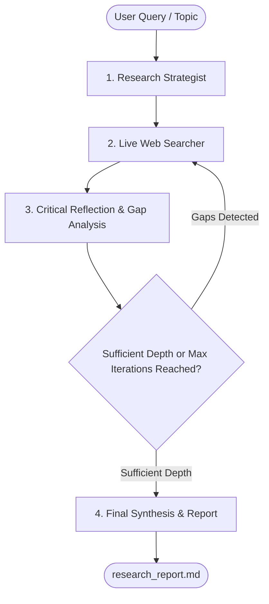

# LangGraph Autonomous Research AI Agent

An unconstrained, deep-thinking Research AI Agent built with **LangGraph**. Designed with an iterative reflection loop that autonomously plans, searches the live web, analyzes knowledge gaps, and synthesizes publication-grade research reports.

---

## Key Features

- **Multi-Thread & Chat History Support**: Organizes research investigations into separate conversation threads with persistent context memory via LangGraph's `MemorySaver`. Ask follow-up questions without losing previous context!
- **No Premature Restrictions / Deep Thinking Loop**: Unlike single-shot AI search tools, this agent recursively analyzes what information is still missing, formulates targeted follow-up queries, and investigates deeper until comprehensive depth is attained.
- **Minimalist & Clean Codebase**: No complex hierarchies, bloated wrappers, or heavy abstractions. Plain Python `TypedDict`, simple single-purpose node functions, and standard LangGraph state flow.
- **Provider Agnostic**: Works out of the box with:
  - **Groq** (`openai/gpt-oss-120b`)
  - **Google Gemini** (`gemini-2.5-flash`)
  - **OpenAI** (`gpt-4o-mini`, `gpt-4o`)
  - **Ollama** (local models like `llama3.1`)
- **Real-Time Dual-Search**: Uses **DuckDuckGo** (text + live breaking news) with automatic upgrade to **Tavily** when a key is provided.

---

## Agent Architecture



---

## Quick Start

### 1. Install Dependencies
```bash
pip install -r requirements.txt
```

### 2. Configure API Keys
Create a `.env` file in the project directory (or copy from `.env.example`):
```env
# Choose at least one LLM key:
GEMINI_API_KEY=your_gemini_api_key_here
# or
OPENAI_API_KEY=your_openai_api_key_here
# or
GROQ_API_KEY=your_groq_api_key_here

# Optional: Higher-tier search API (DuckDuckGo is used if left blank)
TAVILY_API_KEY=your_tavily_api_key_here
```

### 3. Run Deep Research

#### Option A: Streamlit Web UI (Interactive Cockpit)
```bash
streamlit run app.py
```
This opens the web interface in your browser where you can:
- Enter research topics and select depth (1–5 reflection cycles).
- Watch live agent thoughts unfold (`st.status`).
- Inspect web evidence snippets gathered from live searches.
- Read and download the final comprehensive Markdown report.

#### Option B: Terminal CLI
```bash
# Interactive mode
python main.py

# Command-line mode with topic and max depth
python main.py --topic "State of Solid State EV Batteries in 2026" --max-iterations 3

# Specify model and output path
python main.py --topic "Mechanisms of Quantum Computing Fault Tolerance" -i 3 -o quantum_report.md
```

---

## Project Structure

- `app.py`: Modern Streamlit interactive frontend with live thinking status and report download.
- `state.py`: Defines the state schema (`ResearchState`) using `TypedDict` and accumulators.
- `tools.py`: Search tool abstraction (DuckDuckGo Search and Tavily).
- `config.py`: Model loader and rigorous prompt templates.
- `agent.py`: LangGraph StateGraph nodes (`plan`, `search`, `reflect`, `synthesize`) and conditional routing.
- `main.py`: Interactive CLI with live streaming progress.
