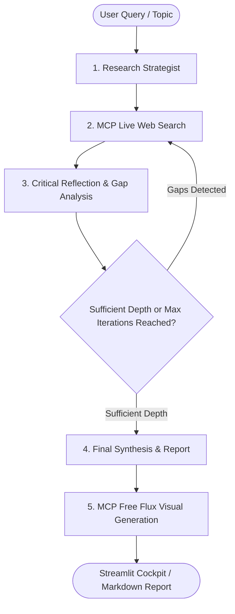

# LangGraph Autonomous Research AI Agent

An unconstrained, deep-thinking Research AI Agent built with **LangGraph**. Designed with an iterative reflection loop that autonomously plans, searches the live web, analyzes knowledge gaps, and synthesizes publication-grade research reports.

---

## Key Features

- **Model Context Protocol (MCP) Tool Calling**: Standardized tool execution via **FastMCP** (`mcp_server.py`), enabling standardized client-server tool invocation and compatibility with external MCP clients (like Claude Desktop or Cursor).
- **100% Free AI Visual Generation (Flux.1 Engine)**: Automatically crafts and renders 3D concept graphics and infographics with zero API keys.
- **Multi-Thread & Chat History Support**: Organizes research investigations into separate conversation threads with persistent context memory via LangGraph's `MemorySaver`.
- **No Premature Restrictions / Deep Thinking Loop**: Recursively analyzes what information is still missing, formulates targeted follow-up queries, and investigates deeper until comprehensive depth is attained.
- **Provider Agnostic**: Works out of the box with **Groq** (`openai/gpt-oss-120b`), **Google Gemini**, **OpenAI**, and **Ollama**.
- **Real-Time Dual-Search**: Uses **DuckDuckGo** (text + live breaking news) with automatic upgrade to **Tavily** when a key is provided.

---

## Agent Architecture



---

## Quick Start

### 1. Install Dependencies
```bash
pip install -r requirements.txt
```

### 2. Configure API Keys
Create a `.env` file in the project directory (or copy from `.env.example`):
```env
# Choose at least one LLM key:
GROQ_API_KEY=your_groq_api_key_here
# or
GEMINI_API_KEY=your_gemini_api_key_here
# or
OPENAI_API_KEY=your_openai_api_key_here

# Optional: Higher-tier search API (DuckDuckGo is used if left blank)
TAVILY_API_KEY=your_tavily_api_key_here
```

### 3. Run Deep Research

#### Option A: Streamlit Web UI (Interactive Cockpit)
```bash
streamlit run app.py
```
This opens the web interface in your browser where you can:
- Switch between multiple research conversation threads.
- Watch live agent thoughts unfold (`st.status`).
- Inspect web evidence snippets gathered from live MCP searches.
- View the generated Flux AI visual banner and download the Markdown report.

#### Option B: Standalone MCP Server
You can also run the MCP server standalone to connect with external MCP-compatible clients:
```bash
python mcp_server.py
```

---

## Project Structure

- `mcp_server.py`: Official FastMCP tool server (`search_web`, `generate_image`, `fetch_page`).
- `mcp_tools.py`: MCP client bridge connecting LangGraph to the MCP server.
- `app.py`: Streamlit multi-threaded interactive frontend with visual generation and MCP indicators.
- `state.py`: Defines the state schema (`ResearchState`) using `TypedDict` and accumulators.
- `tools.py`: Core search and image generation engines.
- `config.py`: Model loader and ground-truth anchored prompt templates.
- `agent.py`: LangGraph StateGraph nodes (`plan`, `search`, `reflect`, `synthesize`) and conditional routing.
- `main.py`: Interactive CLI with live streaming progress.
