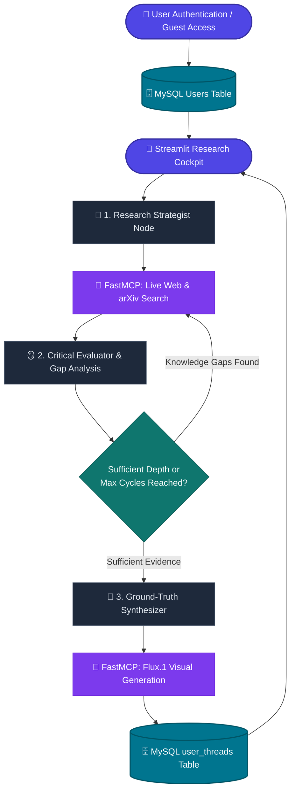

<div align="center">

# 🔬 Autonomous Research AI Agent

**An unconstrained, deep-thinking research intelligence agent powered by LangGraph, Groq LPU inference, FastMCP tool execution, real-time web & arXiv academic search, zero-cost Flux.1 visual generation, and MySQL-backed user authentication.**

[](https://ai-research-agent-cpap9aq7vfxuvnbzkfkhck.streamlit.app/)
[](https://www.python.org/)
[](https://langchain-ai.github.io/langgraph/)
[-8A2BE2.svg?style=flat)](https://github.com/jlowin/fastmcp)
[](https://groq.com/)
[](https://www.mysql.com/)

[**🌐 Explore Live Demo**](https://ai-research-agent-cpap9aq7vfxuvnbzkfkhck.streamlit.app/) • [**✨ Key Features**](#-key-features) • [**🧠 Architecture**](#-system-architecture) • [**🗄️ Database**](#-mysql-database--security) • [**⚡ Quick Start**](#-quick-start) • [**🚀 Deployment**](#-one-click-cloud-deployment)

---

</div>

## 🌟 Highlights

Traditional chatbots answer queries using static, outdated training weights. This **Autonomous Research AI Agent** is a full-stack, cyclic agentic system that formulates investigative hypotheses, navigates live real-world web data across breaking news and peer-reviewed arXiv academic papers, critically reflects on knowledge gaps, iteratively deepens its research, and synthesizes publication-grade reports with verified source citations and accompanying visual concept art.

```
       User Inquiry ➔ Autonomous Strategy ➔ Dual-Engine Web & arXiv Search
                              │                                │
                              ▼                                ▼
                     Flux Visual Concept ⬅ Final Synthesis ⬅ Dynamic Reflection Loop
                              │
                              ▼
                     MySQL Cloud Storage (User-Isolated Chat History & Sessions)
```

---

## ✨ Key Features

### 1. 🧠 Autonomous LangGraph Reflection Loop
- **Multi-Cycle Deepening**: Automatically formulates 2–3 targeted search queries, critiques gathered evidence against the core question, identifies knowledge gaps, and executes follow-up searches until comprehensive depth is reached.
- **Parametric Override**: Ground-truth anchored synthesizer that prioritizes live 2026 search evidence over historical model training cutoffs.

### 2. 🗄️ MySQL-Backed Authentication & Cloud History
- **Salted `bcrypt` Password Hashing**: Passwords are cryptographically salted and hashed before insertion (zero plaintext storage).
- **User-Isolated Conversations**: Research threads are automatically synchronized to MySQL per user ID, enabling cross-device access and private history.
- **Guest Exploration Mode**: Instant 1-click guest access for evaluating the system without an account.

### 3. 🔌 FastMCP Server with Dual Web & arXiv Research
- **FastMCP Protocol** (`mcp_server.py`): Decoupled tool server providing `search_web`, `search_academic`, `generate_image`, and `fetch_page`.
- **Peer-Reviewed arXiv Integration**: Automatically searches academic literature and preprints for deep scientific and technical queries.
- **Universal Compatibility**: Can be connected to LangGraph, Claude Desktop, or Cursor.

### 4. 🎨 100% Free AI Concept Visuals (Flux.1 Engine)
- **Zero-Cost Visual Generation**: Generates high-resolution 3D conceptual infographics for each research subject via Pollinations Flux.1.
- **No API Keys Required**: Completely free and unlimited for all users with built-in refusal guards.

### 5. 💬 Modern Professional Chatbot UI (`app.py`)
- **Perplexity-Style Source Chips**: Interactive badge pills linking directly to verified web citations and academic papers.
- **Framed Visual Cards**: High-res concept cards with built-in preview and download capabilities.
- **Collapsible Research Log**: Step-by-step thinking traces displaying queries, reflections, and tool responses.

### 6. ⚡ Ultra-Fast Multi-Provider LLM Engine
- **Default Engine**: **Groq LPU** (`openai/gpt-oss-120b` or `openai/gpt-oss-20b`) for 500+ tokens/second inference.
- **Multi-Model Support**: Native support for **Google Gemini** (`gemini-2.5-flash`), **OpenAI** (`gpt-4o`), and offline **Ollama** (`llama3.1`).

---

## 🧠 System Architecture



---

## 🗄️ MySQL Database & Security

The system automatically initializes and manages two relational tables in MySQL / TiDB Cloud:

### 1. `users` Table (User Accounts)
| Column | Type | Description |
| :--- | :--- | :--- |
| `id` | `VARCHAR(36)` (PK) | Unique UUIDv4 user identifier |
| `username` | `VARCHAR(50)` (Unique) | User display name / handle |
| `email` | `VARCHAR(100)` (Unique) | User email address |
| `password_hash` | `VARCHAR(255)` | Salted `bcrypt` one-way hash |
| `created_at` | `DATETIME` | Account registration timestamp |
| `last_login` | `DATETIME` | Most recent login timestamp |

### 2. `user_threads` Table (Research Conversations)
| Column | Type | Description |
| :--- | :--- | :--- |
| `thread_id` | `VARCHAR(36)` (PK) | LangGraph Thread UUID |
| `user_id` | `VARCHAR(36)` (FK) | Owner user ID (Cascading delete) |
| `title` | `VARCHAR(255)` | Conversation title |
| `messages_json` | `LONGTEXT` | Full chat history, thinking logs, sources & visual URLs |
| `updated_at` | `DATETIME` | Timestamp of latest inquiry |

---

## 📊 Comparison Matrix

| Feature | Standard LLM Chat | Simple Web RAG | 🔬 This Research Agent |
| :--- | :---: | :---: | :---: |
| **Real-time News & Web Search** | ❌ (Static Cutoff) | ⚠️ (Single Search) | ✅ **Multi-Cycle Deep Search** |
| **Peer-Reviewed arXiv Research** | ❌ None | ❌ None | ✅ **Built-in arXiv Open API** |
| **Knowledge Gap Reflection** | ❌ None | ❌ None | ✅ **Autonomous Loop (`plan ➔ reflect`)** |
| **Tool Protocol** | Proprietary | Ad-hoc | ✅ **Model Context Protocol (MCP)** |
| **Visual Concept Generation** | ❌ None / Paid | ❌ None | ✅ **100% Free Flux.1 Concept Cards** |
| **User Authentication** | ❌ None | ❌ None | ✅ **Salted `bcrypt` + MySQL** |
| **Cross-Device Persistent History** | ❌ None | ⚠️ Browser Storage | ✅ **Cloud MySQL `user_threads`** |

---

## ⚡ Quick Start

### 1. Clone the Repository
```bash
git clone https://github.com/Sanil656/AI-Research-Agent.git
cd AI-Research-Agent
```

### 2. Create and Activate Virtual Environment
```bash
python -m venv venv
# Windows:
.\venv\Scripts\activate
# macOS/Linux:
source venv/bin/activate
```

### 3. Install Dependencies
```bash
pip install -r requirements.txt
```

### 4. Configure Environment
Create a `.env` file in the root directory (or copy `.env.example`):
```env
# Free Groq API Key (get from https://console.groq.com)
GROQ_API_KEY=gsk_your_groq_api_key_here
DEFAULT_LLM_PROVIDER=groq
GROQ_MODEL=openai/gpt-oss-120b

# MySQL Database (TiDB Cloud Serverless or Localhost)
MYSQL_HOST=gateway01.ap-southeast-1.prod.aws.tidbcloud.com
MYSQL_PORT=4000
MYSQL_USER=your_user.root
MYSQL_PASSWORD=your_password
MYSQL_DATABASE=test
```

### 5. Launch the Application

#### 🌐 Interactive Streamlit Web UI
```bash
streamlit run app.py
```

#### 💻 Terminal CLI Mode
```bash
python main.py
```

#### 🔌 Standalone FastMCP Tool Server
```bash
python mcp_server.py
```

---

## 🚀 One-Click Cloud Deployment

You can deploy your own instance to **Streamlit Community Cloud** for free:

1. Fork or push this repository to your GitHub account.
2. Go to [**share.streamlit.io**](https://share.streamlit.io/) and click **Create App**.
3. Select your repository: `AI-Research-Agent`, Branch: `main`, Main file: `app.py`.
4. In **Settings ➔ Secrets**, paste:
   ```toml
   GROQ_API_KEY = "gsk_your_groq_key_here"
   DEFAULT_LLM_PROVIDER = "groq"
   GROQ_MODEL = "openai/gpt-oss-120b"

   [mysql]
   host = "your_mysql_or_tidb_host"
   port = 4000
   user = "your_user"
   password = "your_password"
   database = "test"
   ```
5. Click **Deploy**! Your app will be live with a public URL in seconds.

---

## 📁 Repository Structure

```text
├── app.py              # Streamlit chatbot UI with Auth gatekeeper, source chips & visual cards
├── database.py         # MySQL connection manager, bcrypt security & user-isolated threads
├── agent.py            # LangGraph StateGraph engine with reflection loop & memory
├── state.py            # ResearchState TypedDict schema with multi-turn chat history
├── mcp_server.py       # Standalone FastMCP Tool Server (search, arxiv, image, scrape)
├── mcp_tools.py        # LangGraph client connector for FastMCP tools
├── tools.py            # DuckDuckGo Dual Search, arXiv Open Search & Pollinations Flux generator
├── config.py           # Multi-provider LLM factory (Groq, Gemini, OpenAI, Ollama)
├── main.py             # Rich interactive Terminal CLI client
├── requirements.txt    # Production dependencies
├── .env.example        # Environment variable template
└── README.md           # Project documentation
```

---

## 🛡️ Privacy & Security

- **Salted Password Security**: Passwords are never stored in plaintext and are protected by `bcrypt` (12 rounds).
- **SQL Injection Immune**: 100% Parameterized queries across all database transactions.
- **Git-Protected**: Local `.env` credentials and database passwords are permanently protected via `.gitignore`.

---

<div align="center">

**Built with ❤️ using LangGraph, FastMCP, Streamlit, MySQL, and Groq.**

</div>
